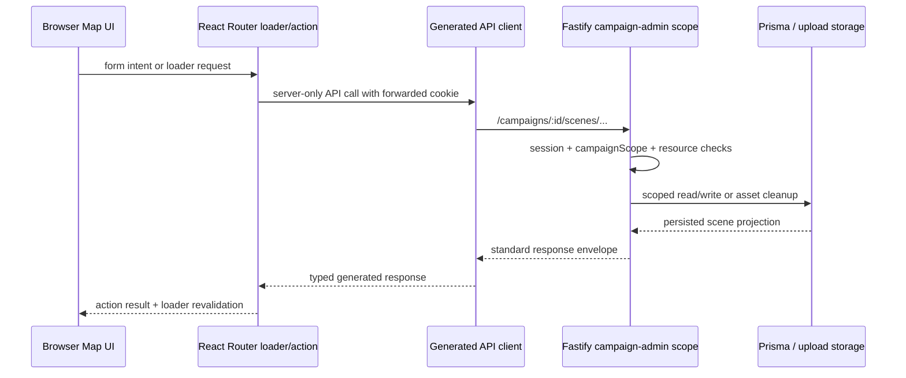

# Scenes and Maps — Current Architecture Design

**Status:** Ready for implementation planning  
**Date:** 2026-07-19  
**Supersedes:** The 2026-05-14 scenes-and-maps draft from the archived `feat/map` branch

## Summary

Constancia will add a GM-only Map workspace where a game master can create persistent scenes,
attach one uploaded map image to each scene, and place typed pegs for existing events, NPCs, and
lore entries. Event pegs can fire the existing event pipeline through the same reliable execution
path used by Play. NPC and lore pegs provide a compact preview and a route into the existing
management workspace.

The feature is additive. It does not replace Discord channels, the channel-derived filter in Play,
or any existing event/NPC/lore records. The backend remains the source of truth, the bot remains a
pure API client with no map behavior, and browser code reaches the backend only through React Router
loaders and actions.

## Why the May Draft Needs Rewriting

The original product idea is still sound, but its implementation assumptions predate the current
repository:

- Fastify request/response validation now uses the JSON Schema constants in
  `apps/backend/src/schemas.ts`, not route-local Zod schemas.
- Campaign authorization is provided by `campaignAdminScopePlugin` and the branded
  `request.campaignScope`, not a `requireCampaignGm` helper.
- Uploads belong to the internal Better Auth `User.id`; campaign administration is authorized by a
  linked Discord user ID. Those identities must not be treated as interchangeable.
- The frontend is a React Router 7 server boundary. Browser components must not value-import or call
  `@constancia/api-client`.
- Live War Room data is shaped by explicit server projection adapters. Map data needs its own
  projection rather than another ad hoc browser fan-out.
- The existing Play “Scene Filter” is a channel-derived event filter. It is not a persistent scene
  model and must not be silently converted into one.
- The frontend has no Vitest unit-test workspace. Cross-layer acceptance behavior currently belongs
  in Playwright BDD, while backend behavior belongs in Vitest and opt-in database integration tests.

## Domain Language

### Scene

A **Scene** is a persistent GM workspace inside one campaign. It has a name, zero or one map image,
and zero or more pegs. A scene may represent a location, encounter, investigation board, or any
other spatial grouping useful to the GM.

A Scene is deliberately independent of a Discord `Channel` and of `ChannelType.scene`. A channel is
a delivery and filtering context; a Scene is a map workspace. No automatic relationship is inferred
between them.

### Map asset

A **map asset** is an existing `UploadAsset` attached one-to-one to a Scene. It uses the current
image moderation, WebP processing, storage, quota, and public delivery path.

### Peg

A **Peg** is a spatial reference from one Scene to exactly one existing campaign resource:

- an `Event`,
- an `Npc`, or
- a `LoreEntry`.

Its `x` and `y` values are normalized coordinates from `0` to `1` relative to the rendered map
image. Coordinates therefore survive responsive resizing and zoom changes.

## Goals

- Let a GM create, rename, select, and delete map scenes.
- Let a GM upload, replace, and remove one map image per scene.
- Let a GM place, move, inspect, and remove event, NPC, and lore pegs.
- Reuse existing records rather than copying their content into scene data.
- Fire an event peg through the current idempotent event-execution endpoint.
- Keep live and demo Map workspaces visually and behaviorally aligned.
- Preserve campaign authorization, upload ownership, storage cleanup, and database integrity.
- Keep the feature isolated from the event block pipeline and Discord bot architecture.

## Non-goals

- Player-facing maps, fog of war, or selective player visibility.
- Discord bot commands for scene or map management.
- Drawing tools, freehand annotations, polygons, measurement, grids, or snapping.
- Multiple map layers or multiple images in one scene.
- Real-time multi-GM cursors or collaborative editing.
- Importing a VTT map format.
- Making persistent Scenes synonymous with Discord channels.
- Copying event, NPC, or lore content into a peg snapshot.
- Reworking the existing global upload delivery policy.

## User Experience

### Navigation and selection

Add **Map** to the shared War Room navigation after Play. The live route is `/map`; the equivalent
demo route is `/demo/map`.

The Map workspace uses a compact scene index, a central map canvas, and an inspector/action panel.
The selected scene is represented by `?scene=<sceneId>` so selection is reload-safe and linkable.
When no scene is requested, the first available scene is selected. An invalid or cross-campaign ID
falls back to the first scene and shows a non-destructive notice.

When a campaign has no scenes, the workspace shows one clear action: **Create first scene**. Creating
a scene selects it immediately. Scene names are trimmed, required, and limited to 80 characters;
duplicate names are allowed because separate encounters may intentionally reuse a location name.

### Map lifecycle

A scene without a map remains usable as a named workspace, but peg placement is disabled. The canvas
shows an upload action and the current image size limit.

Uploading or replacing a map is one user operation even though the frontend server performs two
backend calls: upload the image, then attach the returned asset ID to the scene. If attachment fails,
the frontend server releases the still-unlinked upload so it does not consume quota indefinitely.

Removing a map removes its pegs only if the GM explicitly deletes those pegs; it does not implicitly
destroy spatial work. The pegs remain stored and reappear at the same normalized coordinates when a
new map is attached. The UI warns about this before map removal or replacement.

Deleting a scene deletes its pegs and detaches/cleans its map asset. It never deletes the referenced
events, NPCs, or lore entries.

### Placing and moving pegs

The inspector lists campaign events, NPCs, and lore entries, grouped by type and searchable by name.
Already placed resources are visibly marked and cannot be placed a second time in the same scene.

Peg placement is a deliberate two-step interaction:

1. Choose **Place on map** for a resource.
2. Click or tap the map at the desired location.

Escape cancels placement. Placement mode is explicit in text and cursor treatment. A peg can then be
dragged to a new location. The map frame—not the surrounding canvas—is the coordinate reference.
Dragging uses pointer capture, clamps the final coordinate to the image bounds, and saves on pointer
release rather than on every movement event.

Peg positions update optimistically in the browser. A failed save restores the last server position
and leaves an adjacent retry message. Zoom and pan are presentation state only and never alter stored
coordinates.

### Peg behavior

Each peg is a real button with a type label and accessible resource name.

- **Event:** Opens an inline inspector containing name, type, status, and preview. Firing uses an
  inline arm-then-confirm interaction, never a modal. The action creates an idempotency key and calls
  the existing `fireEvent` backend operation. The response shows execution and delivery status.
- **NPC:** Opens a compact portrait/name/description preview and an **Open NPC dossier** link. The NPC
  workspace continues to own fact revelation and player-access management.
- **Lore:** Opens title/content preview and an **Open lore library** link. The Lore workspace
  continues to own revelation and player-access management.

NPC and lore destination routes should accept a selection query parameter as a small companion
change so the correct record opens, rather than merely navigating to the top of the list.

### Existing Play filter terminology

The existing Play rail derives its values from Discord channels. Its user-facing terminology changes
from scene to channel: **Scene Filter** becomes **Channel Filter**, **All Scenes** becomes **All
Channels**, and the active-scene copy becomes active-channel copy. Internal component and `Tag` names
may remain until a separate cleanup, but this feature must not migrate, delete, or reinterpret that
data.

### Demo behavior

The demo route uses deterministic scene, map, and peg projections and the same visual components as
live Map. Demo mutations are local to the demo session and never call the backend. The demo should
cover the empty, mapped, placement, inspection, and event-arm states without depending on a live
database or upload service.

## Persistence Design

### Scene

| Field | Shape | Notes |
| --- | --- | --- |
| `id` | `String @id @default(cuid())` | Stable scene identity |
| `name` | `String` | Trimmed, 1–80 characters at the API boundary |
| `campaignId` | `String` | Required campaign owner |
| `createdAt` | `DateTime @default(now())` | Stable list ordering fallback |
| `updatedAt` | `DateTime @updatedAt` | Supports fresh projections |

`Campaign.scenes` is one-to-many with `onDelete: Cascade`. `Scene.pegs` is one-to-many with
`onDelete: Cascade`.

### UploadAsset change

Add nullable, unique `sceneId` to `UploadAsset` with a named one-to-one Scene map relation. The
foreign key lives on `UploadAsset`, matching the existing event ownership relation and allowing a
scene to exist before it has a map.

A database `CHECK` constraint enforces that an upload cannot be both an event asset and a scene map:

```sql
CHECK (NOT ("eventId" IS NOT NULL AND "sceneId" IS NOT NULL))
```

The unique `sceneId` constraint guarantees at most one map asset per scene. Application validation
also requires the attaching Better Auth user to own the upload and allows only an unlinked asset or
the asset already attached to that same scene.

### ScenePeg

| Field | Shape | Notes |
| --- | --- | --- |
| `id` | `String @id @default(cuid())` | Stable peg identity |
| `sceneId` | `String` | Parent scene; cascade on delete |
| `eventId` | `String?` | Event target; cascade peg on target delete |
| `npcId` | `String?` | NPC target; cascade peg on target delete |
| `loreEntryId` | `String?` | Lore target; cascade peg on target delete |
| `x` | `Float` | Normalized horizontal coordinate |
| `y` | `Float` | Normalized vertical coordinate |
| `createdAt` | `DateTime @default(now())` | Audit/order support |
| `updatedAt` | `DateTime @updatedAt` | Move tracking |

The migration adds database constraints that Prisma Schema Language cannot currently express:

- exactly one of `eventId`, `npcId`, and `loreEntryId` must be non-null;
- `x` and `y` must each be between `0` and `1`, inclusive;
- a target may appear only once per scene (`sceneId + targetId` unique per target column).

The API still validates these rules to produce useful 4xx responses. The database constraints are
the final integrity boundary. Every write verifies that the scene and target belong to the same
campaign before inserting a peg.

## Upload Ownership and Cleanup

Campaign administration and upload ownership use different identities:

- `request.campaignScope` proves the session is an owner, GM, or superuser for the campaign;
- `request.access.userId` identifies the internal Better Auth user who owns an `UploadAsset`.

Both checks are required when attaching a map. A Discord ID must never be compared to
`UploadAsset.userId`.

The protected upload API gains a delete operation for an upload owned by the current user only when
it is unlinked (`eventId` and `sceneId` are null). The frontend uses this as compensation when upload
succeeds but map attachment fails.

For replacement and removal, update database ownership first, then clean the former storage object
and row. A cleanup failure must not roll back the visible new map or resurrect a removed map. It is
logged with `assetId`, `sceneId`, and operation, while the old asset remains unlinked so a later
reconciliation task can safely retry. Scene deletion likewise detaches the asset in the same
transaction that deletes the Scene, preserving enough metadata for cleanup.

The current upload endpoint serves processed images at an opaque UUID URL without authentication.
Scene metadata and associations remain GM-only, but byte-level map confidentiality is not added in
this feature. A future private-asset initiative would need an authorized or signed delivery design
that also accounts for existing event/NPC images and Discord rendering.

## Backend API

All scene routes are registered inside the existing `campaignAdminScope` under
`/campaigns/:id/scenes`. They inherit the session guard and campaign-admin pre-handler through
Fastify encapsulation.

| Method | Path | Operation ID | Purpose |
| --- | --- | --- | --- |
| `GET` | `/campaigns/:id/scenes` | `listScenes` | Scene summaries in stable order |
| `POST` | `/campaigns/:id/scenes` | `createScene` | Create a scene |
| `GET` | `/campaigns/:id/scenes/:sceneId` | `getScene` | Hydrated scene and typed pegs |
| `PATCH` | `/campaigns/:id/scenes/:sceneId` | `updateScene` | Rename a scene |
| `DELETE` | `/campaigns/:id/scenes/:sceneId` | `deleteScene` | Delete scene, pegs, and map ownership |
| `PUT` | `/campaigns/:id/scenes/:sceneId/map` | `setSceneMap` | Attach or replace a map asset |
| `DELETE` | `/campaigns/:id/scenes/:sceneId/map` | `deleteSceneMap` | Detach and clean a map asset |
| `POST` | `/campaigns/:id/scenes/:sceneId/pegs` | `createScenePeg` | Place one typed target |
| `PATCH` | `/campaigns/:id/scenes/:sceneId/pegs/:pegId` | `updateScenePeg` | Move a peg |
| `DELETE` | `/campaigns/:id/scenes/:sceneId/pegs/:pegId` | `deleteScenePeg` | Remove a peg |
| `DELETE` | `/uploads/:assetId` | `deleteUnlinkedUpload` | Release a current-user unlinked upload |

Peg creation accepts a discriminated union:

```ts
type CreateScenePegBody =
  | { kind: 'event'; targetId: string; x: number; y: number }
  | { kind: 'npc'; targetId: string; x: number; y: number }
  | { kind: 'lore'; targetId: string; x: number; y: number };
```

The scene detail response returns a matching discriminated `ScenePegView` union with the target
preview embedded. Browser components should not need to inspect nullable foreign keys or join target
records themselves.

Scene list responses contain `id`, `name`, `mapUrl`, `pegCount`, `createdAt`, and `updatedAt`. Scene
detail adds the hydrated pegs. URLs are derived using the existing upload URL builder rather than
trusting or reconstructing storage-provider URLs in the frontend.

Expected response behavior:

- `201` for scene and peg creation;
- `200` for reads, updates, attachment, and deletion envelopes;
- `400` for malformed kinds, coordinates, names, or upload state;
- `401/403` from existing authentication and campaign authorization;
- `404` for a scene, peg, or target outside the scoped campaign;
- `409` when the same target is already placed in the scene.

## Backend Structure

- `scene-routes.ts` owns HTTP parsing, JSON schemas, response codes, and operation IDs.
- `campaign-access.ts` learns the `scene`, `scene-peg`, and `lore` resource kinds so campaign-scoped
  lookup remains centralized.
- A focused scene-map asset service owns attach, detach, replacement, and cleanup semantics.
- `upload-assets.ts` exposes a small generic owned/unlinked validation and cleanup seam used by event
  assets, scene maps, and the protected unlinked-upload delete route.
- `schemas.ts` remains the single hand-written Fastify JSON Schema catalogue.
- `api-routes.ts` registers the new route plugin in the current campaign-admin scope.

No scene or map logic belongs in `packages/core`, `packages/systems`, `packages/contracts`, or
`apps/bot`. Pegs point to platform records; they do not add event-pipeline block behavior.

## Frontend Architecture

### Route boundary

`map.tsx` is a React Router route module with a server `loader` and `action`:

- the loader calls a server-only `loadLiveMapWorkspaceProjection(request, selectedSceneId)` adapter;
- the adapter resolves the current campaign and fans out only the scene and candidate reads needed
  by Map;
- the action handles intent-discriminated create, rename, delete, map upload/remove, peg create/move/
  delete, and event fire operations;
- successful actions rely on React Router loader revalidation rather than a second browser API cache;
- generated API client value imports remain in route modules and `*.server.ts` helpers only.

The browser receives a map-specific `MapWorkspaceProjection` with scene summaries, selected scene,
and typed candidate records. It does not deepen the global `WarRoomProjection` with map-only data.

All submitted forms use `react-hook-form`; structured inputs use Zod and `zodResolver`. Placement and
drag state are interaction state rather than submitted form fields and may use local React state.
Writes use `<Form>`, `useFetcher`, or the existing same-origin `postRouteAction` helper.



### Component boundaries

- `MapWorkspace` composes the route projection and interaction state.
- `SceneIndex` owns selection and scene-level actions.
- `MapViewport` isolates the pan/zoom dependency and normalized coordinate conversion.
- `ScenePegButton` renders the accessible typed marker.
- `MapInspector` owns candidate search, placement mode, and selected-peg details.
- `SceneForm` and `SceneMapForm` own React Hook Form schemas and submission feedback.

`react-zoom-pan-pinch` is the preferred candidate because its current package accepts React 19 and
provides zoom, pan, pinch, and control hooks. It must remain behind `MapViewport`; a focused spike
must verify pointer-event coexistence with peg drag, reset controls, reduced motion, and responsive
image bounds before the dependency is committed.

## Accessibility and Responsive Rules

- Every peg is keyboard-focusable and announces type, resource name, and current position.
- The inspector provides a non-spatial peg list, so selecting, inspecting, moving, and deleting pegs
  does not depend only on map precision.
- Arrow keys nudge a selected peg by 1%; Shift+Arrow nudges by 5%.
- Zoom in, zoom out, and reset are labeled buttons; map gestures are not the only controls.
- Focus is restored to a predictable control after a scene or peg is deleted.
- Status and failure messages use `aria-live` adjacent to the action that produced them.
- Controls retain at least a 44px target and respect reduced-motion preferences.
- Above 860px, the workspace is index + canvas + inspector. Below 860px, the index and inspector
  stack around the canvas without horizontal scrolling.
- The design follows `DESIGN.md`: tonal section boundaries, sharp controls, editorial hierarchy, and
  no decorative event-type color reuse for peg categories.

## Reliability and Error Handling

- Campaign and target scope is checked before every mutation.
- Peg writes are protected by both JSON Schema validation and database constraints.
- Event firing reuses the existing idempotency-key and execution receipt behavior.
- A failed drag rolls the peg back to its server coordinate.
- A stale deleted target naturally removes its peg via database cascade and disappears on
  revalidation.
- Attachment failure compensates by deleting the unlinked current-user upload.
- Storage cleanup failures are structured logs and leave unlinked database records for safe repair.
- The map route has an error boundary that distinguishes campaign/API unavailability from an empty
  campaign.

## Verification Strategy

- Prisma migration validation plus an opt-in PostgreSQL integration test for check/unique/cascade
  behavior.
- Backend Vitest coverage for campaign access, upload ownership, route validation, cross-campaign
  rejection, response hydration, attachment compensation seams, and event reuse.
- OpenAPI assertions for every scene operation ID and generated-client regeneration.
- Playwright BDD for scene lifecycle, placement/move persistence, map replacement, event arm/fire,
  and live/demo navigation parity.
- A manual browser pass for zoom/drag interaction, responsive layout, focus order, and reduced motion.
- Repository gates: lint, typecheck, test, BDD, build, format check, and block-drift check.

## Acceptance Criteria

- A campaign GM can create and select multiple scenes without changing Discord channels.
- A GM can upload, replace, and remove a scene map without orphaning an attached asset.
- Events, NPCs, and lore entries can each be placed once per scene and can appear in multiple scenes.
- Peg coordinates remain correct after reload, resize, zoom, and map replacement.
- Cross-campaign scene, peg, target, and upload references are rejected.
- Event pegs fire through the existing idempotent backend event execution and show a receipt.
- Deleting a target removes its pegs; deleting a scene never deletes its targets.
- The live browser makes no direct backend call and has no browser-side value import from
  `@constancia/api-client`.
- Live and demo navigation expose Map in the same position and render the same core states.
- Existing channel-derived Play filtering continues to work under the clearer “Channel Filter” label.
- No bot, game-system, event-pipeline, or block-registry change is required.

## Decisions and Trade-offs

- **One image per scene:** Keeps the workspace legible and the storage lifecycle bounded. Layered or
  multi-floor maps can be separate scenes.
- **Normalized coordinates:** Adds conversion logic but prevents layout and zoom from corrupting
  stored positions.
- **Polymorphic peg table:** Keeps scene operations uniform while database checks and a discriminated
  API union preserve type safety.
- **Typed embedded peg previews:** Slightly enlarges scene detail responses but avoids nullable-key
  logic and browser-side joins.
- **Dedicated map endpoints:** More API surface than a generic scene patch, but ownership, replacement,
  compensation, and cleanup become explicit operations.
- **Route-specific projection:** Some server fan-out overlaps the parent War Room loader, but Map
  concerns stay isolated and browser boundaries remain obvious.
- **Current public-by-URL images:** Avoids a cross-cutting asset-delivery migration. It is not a claim
  of byte-level secrecy and should be revisited if private GM maps become a product requirement.

## Reference Material

- [React Router route modules](https://reactrouter.com/start/framework/route-module) — server loaders,
  server actions, and automatic loader revalidation.
- [Fastify plugins and encapsulation](https://fastify.dev/docs/latest/Reference/Plugins/) — placing
  scene routes under the existing campaign-admin scope.
- [Prisma one-to-one relations](https://www.prisma.io/docs/orm/prisma-schema/data-model/relations/one-to-one-relations)
  and [referential actions](https://www.prisma.io/docs/orm/prisma-schema/data-model/relations/referential-actions).
- [Prisma PostgreSQL check constraints](https://docs.prisma.io/docs/orm/more/troubleshooting/check-constraints)
  — constraints that remain in migration SQL rather than Prisma Schema Language.
- [react-zoom-pan-pinch](https://github.com/BetterTyped/react-zoom-pan-pinch) and its
  [property reference](https://bettertyped.github.io/react-zoom-pan-pinch/?path=/story/docs-props--page).
